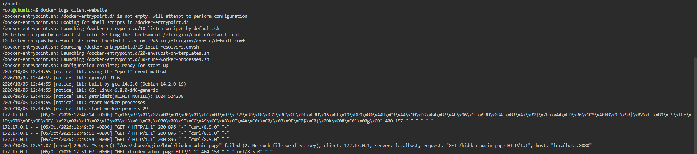
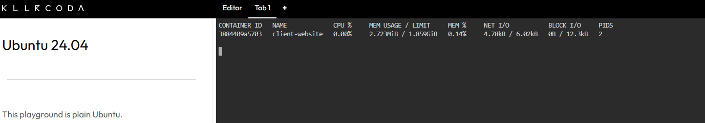

# Container Observability

## Checkpoint 4 - Application Logging

### Docker Logs

The following command was used to retrieve the application logs from the Nginx container:

```bash
docker logs client-website
```

### HTTP 404 Error

```text
172.17.0.1 - - [05/Oct/2026:12:51:07 +0000] "GET /hidden-admin-page HTTP/1.1" 404 153 "-" "curl/8.5.0" "-"
```

Application logs are vital for troubleshooting because they provide a record of requests and errors that occur inside the application. By examining the logs, a Cloud Operations Engineer can identify failed requests and determine the cause of an application problem.




## Checkpoint 5 - Real-Time Container Metrics

### Docker Stats

The following command was used to monitor the container's resource consumption:

```bash
docker stats
```

At the time of the screenshot, the `client-website` container was using:

- **CPU Usage:** 0.00%
- **Memory Usage:** 2.723MiB / 1.859GiB
- **Memory Percentage:** 0.14%
- **Network I/O:** 4.78kB / 6.02kB

The low CPU and memory usage indicate that the Nginx container was operating efficiently during the monitoring period.


